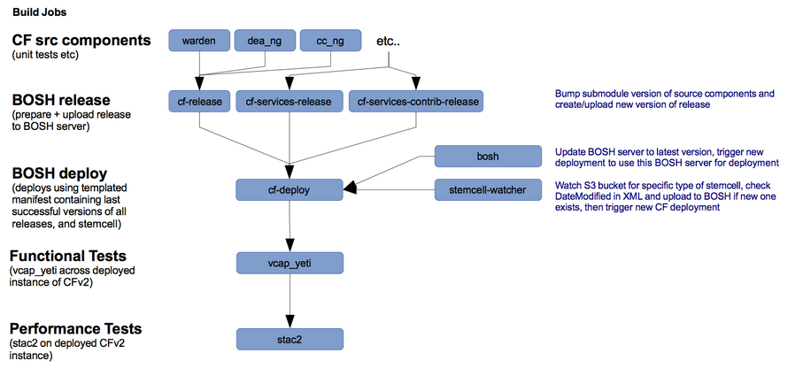

Cloud Foundry v2 Jenkins Build System Cookbook
==


The purpose of this cookbook is to create a Jenkins build and test environment for Cloud Foundry v2 and BOSH.

More and more people are hacking with BOSH and Cloud Foundry, and therefore need a sound environment to develop, deploy and test those changes. The aim is to enable sufficient granularity such that any change to Cloud Foundry or BOSH code is built and tested appropriately before deeming ready for production. 

**This is a work in progress build system - by all means try it and please help improve it, but be aware it is not finished yet and should be considered alpha!**


Build System Workflow
---------------------

The diagram below summarizes the intended workflow of the build system (once everything is implemented):


Currently, it watches for change in the following BOSH releases: cf-release (cf-services-release, and cf-services-contrib-release to follow), and builds dev releases of BOSH from the BOSH repo. These releases are fetched and uploaded to a BOSH server of your choosing within an hour of any new releases being published in their respective git repos.

Pivotal's S3 bucket for BOSH stemcells is regularly polled for newly published stemcell revisions, and if one is found a build is run to download the stemcell from source, and upload it into any BOSH server the build system is aware of.

Builds that successfully upload BOSH releases or new stemcells will then trigger deployments of Cloud Foundry v2 and/or BOSH itself.
These deployments use templated BOSH deployment manifests, which you should keep in a separate git repo. See section below for more info.

TODO: Mutex locks on deploy jobs will ensure that any currently running BOSH release uploads complete successfully before allowing a BOSH deployment build to run.

Once deployments are complete, **vcap-yeti** integration tests and **stac2** performance tests are executed to ensure production viability of the combination of BOSH releases and deploy manifest being tested. 


Supported Installations
------------
**At the moment this cookbook is written for Ubuntu 12.04, and tested using Chef 11.6.2.**

This cookbook only supports Openstack Grizzly for Cloud Foundry v2 deployments right now, although any BOSH supported IaaS should work fine with appropriate cookbook attribute and deploy manifest modifications.

If you're using Openstack, I have successfully tested this build system with quantum and nova-network.

Inner and Outer BOSHs
-----

This build system **depends on the existence of an Outer BOSH** before you can start using it. This Outer BOSH can either be a micro BOSH (I used bosh-bootstrap gem), or a full BOSH - up to you. Deploy one and make a note of its Director IP - see required Chef attributes below.

The Outer BOSH is used to deploy dev releases of BOSH (ie. **the Inner BOSH**) which have passed unit and BATs tests. It'll also automatically deploy new releases of BOSH with any new stemcells that have been uploaded to the Outer BOSH.

**The Inner BOSH** reflects a BOSH that could be deemed production-ready, and is also used by the build system to deploy cf-releases. 

It is assumed both BOSH's will reside in the same target IaaS, using the same Openstack username/password/tenant.

Vagrant deployments
-------------------

I've included a Vagrantfile template with configurations for Virtualbox, VMWare Fusion, and Openstack (where I'm running it).

```
cp Vagrantfile.template Vagrantfile
```

### Install Vagrant

[Download Vagrant](http://downloads.vagrantup.com/ "Vagrant - Downloads")

For example, to download and install Vagrant 1.3.5 for Debian x86:

```
wget http://files.vagrantup.com/packages/a40522f5fabccb9ddabad03d836e120ff5d14093/vagrant_1.3.5_x86_64.deb
sudo dpkg -i vagrant_1.3.5_x86_64.deb
```

### Vagrant Plugins

These plugins are required to be installed before attempting to spin up the VM:

```
vagrant plugin install vagrant-berkshelf
vagrant plugin install vagrant-omnibus
```


#### Openstack Notes

The following environment variables should be set and configured to point at your target Openstack installation before vagrant up:

```OS_AUTH_URL```, ```OS_USERNAME```, ```OS_PASSWORD``` and ```OS_TENANT```.

Then ensure a floating ip is available to assign in your Openstack tenancy, and set os.floating_ip in Vagrantfile with this value.

I used the precise64 cloud AMI image as precise64-cloud from Ubuntu's image repository. 

You'll probably also want to customise the chef.json hash with the relevant attribute values as defined in the section above.
 

```
vagrant plugin install vagrant-openstack-plugin
vagrant up --provider=openstack
```

Setup
---------------------
You need 4 things before you are able to start using this system:

- A working Openstack, a user created with a (preferably blank) tenant assigned
- 4 floating ip's assigned to your tenancy:
  - 1 (or more) for outer bosh, 
  - 2 for inner bosh, and 
  - 1 (or more) for Cloud Foundry v2
- A separate git repository containing BOSH deployment manifest templates
- An Outer BOSH installed into your target IaaS (Micro BOSH or full BOSH)

Once you have installed this cookbook, run some builds:

- First, **kick off a stemcell-watcher job** to get a latest stemcell installed into your existing Outer BOSH (and later Inner BOSH too)
- Once thats finished, **start a bosh-release-upload job** to get a BOSH dev release uploaded to your Outer BOSH
- **This should trigger a bosh-release-deploy job** which will deploy your Inner BOSH for the first time
- Next, you'll need to trigger another **stemcell-watcher job** to get a stemcell uploaded into your Inner BOSH
- Success here should trigger a **cf-release-final-upload** job to upload cf-release into your Inner BOSH
- On success, **this should trigger a cf-release-final-deploy build** to deploy Cloud Foundry v2 through your Inner BOSH.
- Finally, you should see builds running to integration and performance test Cloud Foundry.

Now when new stemcells or final BOSH releases of Cloud Foundry v2 (and services) appear, Jenkins should spring into life and upload/deploy/test them.


Attributes
----------

#### jenkins-cf::default
<table>
  <tr>
    <th>Key</th>
    <th>Type</th>
    <th>Description</th>
    <th>Default</th>
  </tr>
  <tr>
    <td><tt>jenkins_cf.outer_bosh.director_ip </tt></td>
    <td>String</td>
    <td>Outer BOSH director floating ip</td>
    <td><tt></tt></td>
  </tr>
  <tr>
    <td><tt>jenkins_cf.outer_bosh.user </tt></td>
    <td>String</td>
    <td>Outer BOSH director username</td>
    <td><tt>admin</tt></td>
  </tr>
  <tr>
    <td><tt>jenkins_cf.outer_bosh.pass </tt></td>
    <td>String</td>
    <td>Outer BOSH director password</td>
    <td><tt>admin</tt></td>
  </tr>
  <tr>
    <td><tt>jenkins_cf.inner_bosh.director_ip</tt></td>
    <td>String</td>
    <td>Inner BOSH director floating ip</td>
    <td><tt></tt></td>
  </tr>
  <tr>
    <td><tt>jenkins_cf.inner_bosh.powerdns_ip</tt></td>
    <td>String</td>
    <td>Inner BOSH powerdns ip</td>
    <td><tt></tt></td>
  </tr>  
  <tr>
    <td><tt>jenkins_cf.inner_bosh.user </tt></td>
    <td>String</td>
    <td>Inner BOSH director username</td>
    <td><tt>admin</tt></td>
  </tr>
  <tr>
    <td><tt>jenkins_cf.inner_bosh.pass </tt></td>
    <td>String</td>
    <td>Inner BOSH director password</td>
    <td><tt>admin</tt></td>
  </tr> 
  <tr>
    <td><tt>jenkins_cf.inner_bosh.net_id </tt></td>
    <td>String</td>
    <td>Id of Openstack network to ensure booted Cloud Foundry VMs only have a NIC created on that network </td>
    <td><tt></tt></td>
  </tr>     
  <tr>
    <td><tt>jenkins_cf.cloud_controller.ip</tt></td>
    <td>String</td>
    <td>Floating IP address to use for router/cloud controller </td>
    <td><tt></tt></td>
  </tr> 
  
  
  <tr>
    <td><tt>jenkins_cf.cloud_controller.root_domain</tt></td>
    <td>String</td>
    <td>Root domain for CFv2 (eg. for api.test.com you would use test.com here) </td>
    <td><tt></tt></td>
  </tr>   
  <tr>
    <td><tt>jenkins_cf.cloud_controller.admin_user</tt></td>
    <td>String</td>
    <td>Username of CFv2 admin user</td>
    <td><tt>admin</tt></td>
  </tr>   
  <tr>
    <td><tt>jenkins_cf.cloud_controller.admin_pass</tt></td>
    <td>String</td>
    <td>Password of that admin user</td>
    <td><tt>c1oudc0wc1oudc0w</tt></td>
  </tr>   
  <tr>
    <td><tt>jenkins_cf.openstack.auth_url</tt></td>
    <td>String</td>
    <td>Openstack Auth URL, eg: http://xxx.xxx.xxx.xxx:5000/v2.0</td>
    <td><tt></tt></td>
  </tr> 
  <tr>
    <td><tt>jenkins_cf.openstack.user</tt></td>
    <td>String</td>
    <td>Openstack username</td>
    <td><tt></tt></td>
  </tr>   
  <tr>
    <td><tt>jenkins_cf.openstack.api_key</tt></td>
    <td>String</td>
    <td>Openstack API key </td>
    <td><tt></tt></td>
  </tr>    
  <tr>
    <td><tt>jenkins_cf.openstack.tenant</tt></td>
    <td>String</td>
    <td>Openstack tenant</td>
    <td><tt></tt></td>
  </tr>   
  <tr>
    <td><tt>jenkins_cf.git.user</tt></td>
    <td>String</td>
    <td>Git user.name to use in build job triggered git operations</td>
    <td><tt></tt></td>
  </tr>  
  <tr>
    <td><tt>jenkins_cf.git.email</tt></td>
    <td>String</td>
    <td>Git user.email to use in build job triggered git operations</td>
    <td><tt></tt></td>
  </tr>    
  <tr>
    <td><tt>jenkins_cf.git.known_hosts</tt></td>
    <td>Array</td>
    <td>An array of git repo hostnames to add to Jenkins user's ~/.ssh/known_hosts file to ensure auto-acceptance of keys</td>
    <td><tt>[]</tt></td>
  </tr> 
  <tr>
    <td><tt>jenkins_cf.bosh_manifest_git_repo</tt></td>
    <td>String</td>
    <td>BOSH manifest template Git repository URL</td>
    <td><tt></tt></td>
  </tr>    
  <tr>
    <td><tt>jenkins_cf.stemcell_base_url</tt></td>
    <td>String</td>
    <td>Stemcell artifact base URL</td>
    <td><tt>http://bosh-jenkins-artifacts.s3.amazonaws.com</tt></td>
  </tr>      
  <tr>
    <td><tt>jenkins_cf.stemcell</tt></td>
    <td>String</td>
    <td>Stemcell artifact URI (suffixed to the base url)</td>
    <td><tt>bosh-stemcell/openstack/bosh-stemcell-latest-openstack-kvm-ubuntu.tgz</tt></td>
  </tr>       
</table>

	

Usage
-----
#### jenkins-cf::default

Just include `jenkins-cf` in your node's `run_list`:

```json
{
  "name":"my_node",
  "run_list": [
    "recipe[jenkins-cf]"
  ]
}
```

and then customise the cf_jenkins Chef attributes as appropriate. 


Known Issues
------------
- Jenkins system default shell needs to be automatically set to /bin/bash
- Jenkins Git SSH Credentials need to be setup manually after Chef deployment
- cf-services-release, cf-services-contrib-release need uploading manually to BOSH server (build jobs not yet created to automate this)
- bosh-release-upload job seems to fail until BUILD_CANDIDATE env variable >= 3

TODO
----

- **Email notification of success on performance test builds** to alert you when a production-ready build passes.
- **Ability to customize deploy manifest template values more finely** 
  - Build job-specific configuration properties merged into global job properties before applying to a manifest template.
- **Add build jobs for CFv2 individual components** (eg. warden, dea_ng etc) 
  - Ultimately triggering builds of forked cf-release dev releases using bumped submodules of upstream CFv2 components in cf-release. 
  - This will be particularly useful to people who want to modify the framework and automate custom build and deployments of CFv2.
- **Ability to easily configure build system for other IaaS targets**
  - eg. AWS, bosh-lite? Maybe even support multiplying the build jobs to deploy/test into many IaaS targets, controlled by the same build system? eg. for people who are straddling multiple clouds.
- **Make a BOSH release reflecting this Chef cookbook** (anyone wanna help me?)

Contributing
------------

1. Fork the repository on Github
2. Create a named feature branch (like `add_component_x`)
3. Write your change
4. Write tests for your change (if applicable)
5. Run the tests, ensuring they all pass
6. Submit a Pull Request using Github

License and Authors
-------------------
Author: Ryan Grenz 

Licensed under the Apache License, Version 2.0 (the "License"); you may not use this file except in compliance with the License. You may obtain a copy of the License at

```
http://www.apache.org/licenses/LICENSE-2.0
```

Unless required by applicable law or agreed to in writing, software distributed under the License is distributed on an "AS IS" BASIS, WITHOUT WARRANTIES OR CONDITIONS OF ANY KIND, either express or implied. See the License for the specific language governing permissions and limitations under the License.